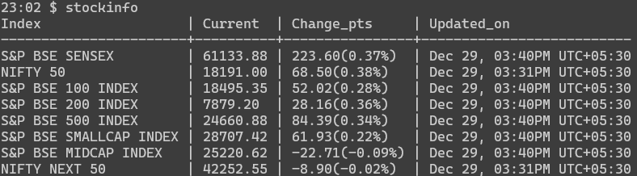
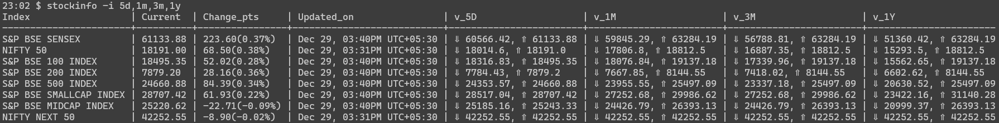
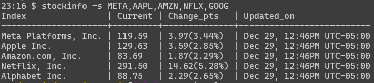

Stock information in CLI
-------------------------

Simple CLI tool to get the current stock value and high and low value of stocks for different interval.

* [Stock information in CLI](#stock-information-in-cli)
* [Install](#install)
* [Examples](#examples)
* [Why this?](#why-this)
  * [Some background](#some-background)
* [Tips](#tips)
  * [Create alias for different stocks](#create-alias-for-different-stocks)
* [Contribute](#contribute)
  * [Bug](#bug)
  * [Feature ask](#feature-ask)
* [License](#license)

## Install


    curl https://raw.githubusercontent.com/arulrajnet/stockinfo-cli/main/stockinfo.py | sudo tee /usr/local/bin/stockinfo
    sudo chmod +x /usr/local/bin/stockinfo


## Examples

By default it will get indian stock market index stocks

    stockinfo



To get the high and low value for different intervals

    stockinfo -i 5d,1m,3m,1y



To get for different stocks

    stockinfo -s META,AAPL,AMZN,NFLX,GOOG



## Why this?

Every month I buy a Index mutual fund. I want to buy that on a best day in last 30 days. The high and low value information of index stocks on different intervals gives the data to take decision.

These are points in my mind while writing this

- Very simple tool to give current value and high and low value for different interval
- No more external module dependencies
- Works with Python3 only

### Some background

Earlier I used these scrips which are depends on Google Finance API. Those are stopped working because of google pulled the plug.

[GetStockInfo.py](https://gist.github.com/arulrajnet/cb1476234967717a4d6d)

[stockmarketindia.py](https://gist.github.com/arulrajnet/21addbacdbdfd6e190f4)

This repo is using Yahoo Finance API :smiley: I heard your voice, [refer](API.md#alternative) for alternatives for the future.

## Tips

### Create alias for different stocks

For example

```
alias stockfaang="stockinfo -s META,AAPL,AMZN,NFLX,GOOG"
alias stockindia="stockinfo -s %5EBSESN,%5ENSEI"
```

## Contribute


### Bug

* Create a issue with label bug
* Create PR if you know the fix

### Feature ask

* Create a issue with label enhancement
* Start discussion with maintainer
* Create PR once finalized

Mostly don't want to add any extra feature if its deviate from [why-this](#why-this)

## License

[MIT License][mit_license].

**Author**

| [![follow][avatar]][twitterhandle] |
|---|
| [@arulrajnet][twitterhandle] |

[twitterhandle]: https://twitter.com/arulrajnet "Follow @arulrajnet on Twitter"
[avatar]: https://avatars0.githubusercontent.com/u/834529?s=70
[mit_license]: LICENSE
